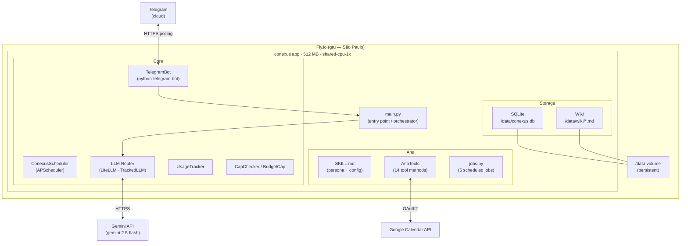
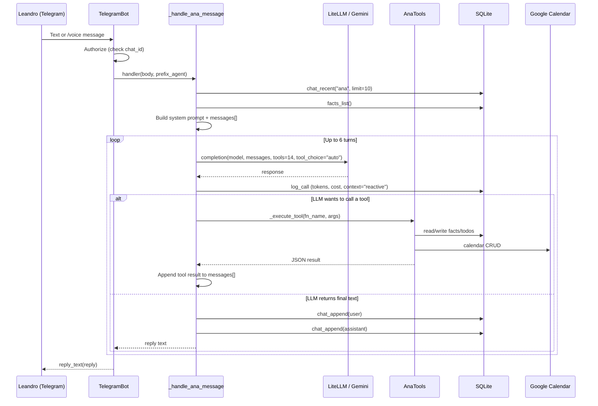
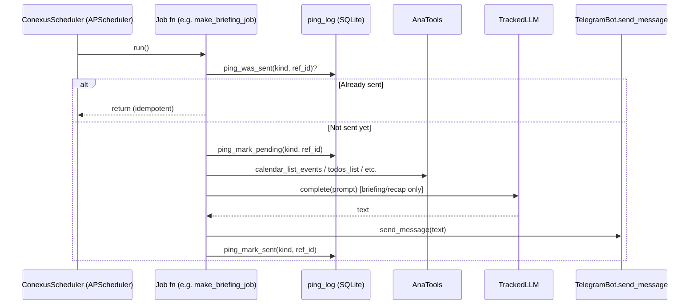
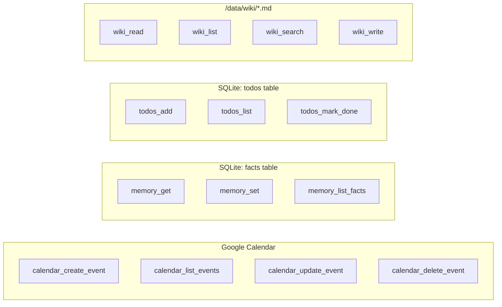
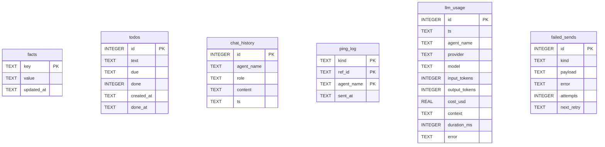
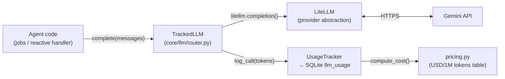
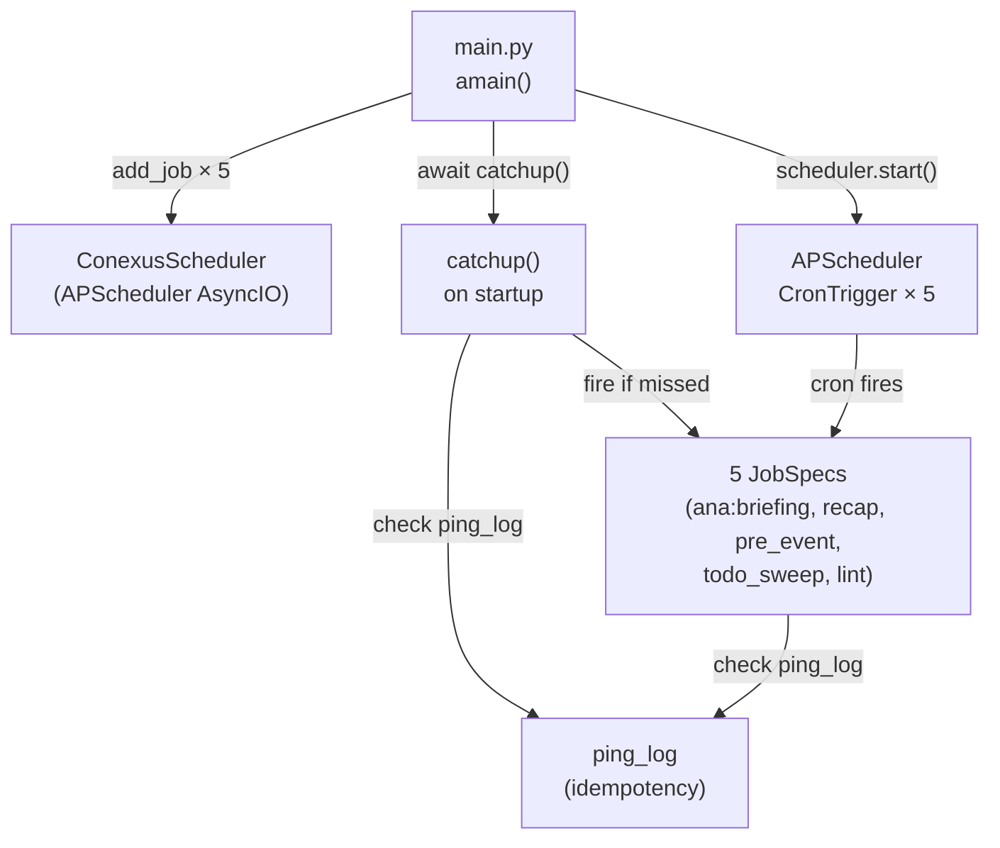
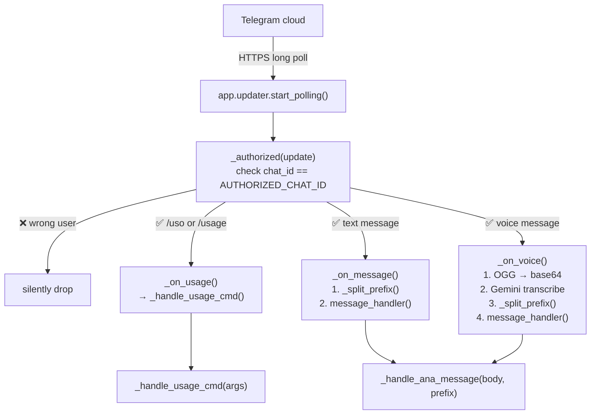
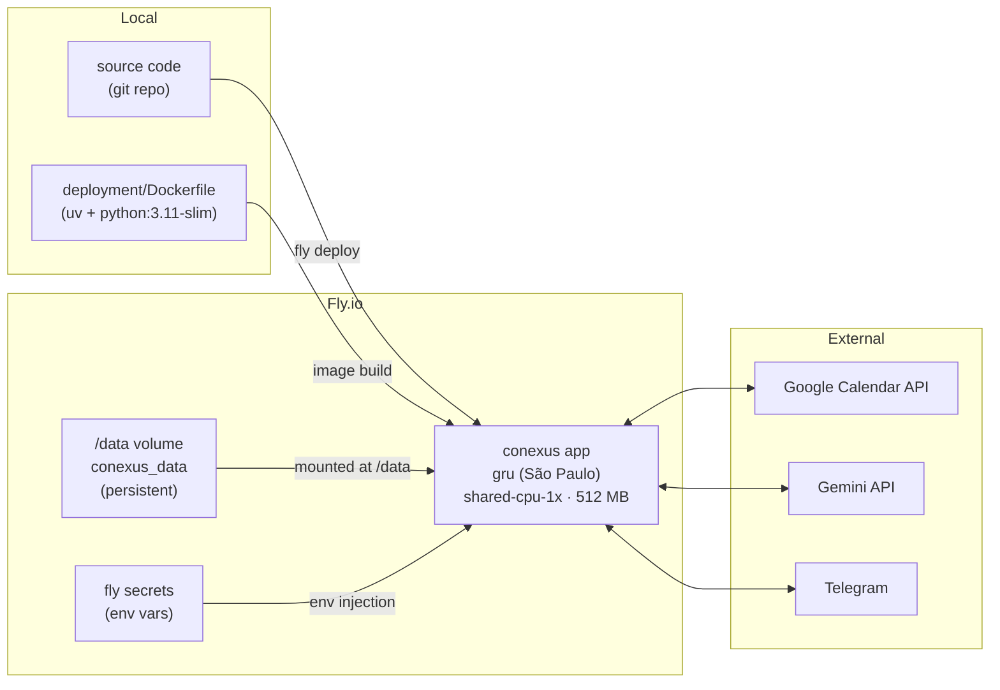

# Conexus — System Documentation

> Personal AI agent infrastructure. Read this to understand how everything works,
> how to operate it, and how to add new agents.

---

## Table of Contents

1. [What Is Conexus?](#1-what-is-conexus)
2. [High-Level Architecture](#2-high-level-architecture)
3. [Message Flow — Reactive (User Sends a Message)](#3-message-flow--reactive)
4. [Message Flow — Proactive (Scheduler Fires)](#4-message-flow--proactive)
5. [Agents: Ana](#5-agents-ana)
6. [Storage Layer](#6-storage-layer)
7. [LLM Stack](#7-llm-stack)
8. [Scheduler](#8-scheduler)
9. [Telegram Bot](#9-telegram-bot)
10. [Deployment: Fly.io](#10-deployment-flyio)
11. [Secrets & Environment Variables](#11-secrets--environment-variables)
12. [How to Add a New Agent](#12-how-to-add-a-new-agent)

---

## 1. What Is Conexus?

Conexus (also written Co-Nexus) is Leandro's personal AI agent infrastructure.
It runs 24/7 on Fly.io (São Paulo, `gru`) and communicates exclusively via Telegram.

**Currently running agents:**

| Agent | Role | Language |
|-------|------|----------|
| Ana   | Personal secretary / executive assistant | pt-BR |

**Planned agents:** Researcher (news/research), Code Manager (code analysis).

All agents share the same infrastructure:
- LLM routing via LiteLLM
- SQLite for memory, todos, chat history
- Markdown wiki on the Fly.io volume
- Telegram bot for all communication
- APScheduler for proactive tasks

---

## 2. High-Level Architecture



---

## 3. Message Flow — Reactive

What happens when you send a message to Ana on Telegram.



**Key details:**
- Budget is checked before every reactive call. If daily limit ($0.25) is exceeded, Ana replies immediately without calling the LLM.
- Voice messages: Telegram OGG → base64 → Gemini multimodal → transcription text → same flow above.
- The system prompt includes the current date/time (BRT) and instructs Ana to use tools rather than describe what she would do.
- Chat history (last 10 messages) and all known facts are injected into every call.

---

## 4. Message Flow — Proactive

What happens when the scheduler fires a job.



**Idempotency:** Every job uses `ping_log` as a write-ahead log. If the process crashes after sending but before marking as sent, it will re-send on restart. If it crashes before sending, it picks up at startup via `catchup()`.

**Catchup on startup:** `ConexusScheduler.catchup()` runs once at startup. For `briefing` and `recap`, if today's ping hasn't been sent yet (and we're before the cutoff hour), it fires immediately.

---

## 5. Agents: Ana

### Anatomy of an agent

Every agent consists of three files:

```
agents/<name>/
├── SKILL.md     ← persona, config (frontmatter) + system prompt (body)
├── tools.py     ← tool methods the LLM can call
└── jobs.py      ← proactive scheduled job builders
```

### Ana's SKILL.md (frontmatter)

```yaml
name: Ana
role: Assistente pessoal e secretária executiva
language: pt-BR
llm:
  provider: gemini
  model: gemini-2.5-flash
  temperature: 0.4
schedules:
  - { kind: briefing,   cron: "0 7 * * *"   }   # 07:00 daily
  - { kind: recap,      cron: "0 21 * * *"  }   # 21:00 daily
  - { kind: pre_event,  cron: "*/5 * * * *" }   # every 5 min
  - { kind: todo_sweep, cron: "0 9-20 * * *"}   # hourly 09-20
  - { kind: lint,       cron: "0 22 * * 0"  }   # Sunday 22:00
budget:
  daily_usd: 0.25
  monthly_usd: 6.00
  on_exceed: notify
```

### Ana's 14 tools



### Ana's 5 scheduled jobs

| Job | Cron | What it does |
|-----|------|--------------|
| `briefing` | `0 7 * * *` | Reads today's events + open todos → LLM → sends morning summary |
| `recap` | `0 21 * * *` | Reads today's events + open todos → LLM → sends evening recap |
| `pre_event` | `*/5 * * * *` | Queries next 10-20 min of events → sends `⏰ Em ~15 min: <title>` per event (no LLM) |
| `todo_sweep` | `0 9-20 * * *` | Checks for overdue todos → sends one consolidated warning per day (no LLM) |
| `lint` | `0 22 * * 0` | Weekly wiki audit — currently a stub that sends a confirmation |

---

## 6. Storage Layer

### SQLite database: `/data/conexus.db`



**Table purposes:**
- `facts` — Ana's persistent key-value memory. Set/get by name, e.g. `leandro_timezone = America/Sao_Paulo`.
- `todos` — Task list with optional due date. Status: `open` / `done`.
- `chat_history` — Last N messages per agent. Used to inject conversation context.
- `ping_log` — Idempotency guard for scheduled jobs. Prevents duplicate sends on restart.
- `llm_usage` — Every LLM call logged. Used by `/uso` command. Cost computed dynamically from token counts × pricing table.
- `failed_sends` — Outbox for failed Telegram sends (retry queue, v1 not yet implemented).

### Wiki: `/data/wiki/`

Flat filesystem of Markdown files, managed by `WikiStore`. Structure:

```
/data/wiki/
├── index.md           ← master index (links to all pages)
├── log.md             ← append-only change log
├── about/
│   └── conexus.md     ← what Conexus is
├── preferences/
│   └── leandro.md     ← Leandro's scheduling preferences, etc.
├── projects/          ← one file per project
├── people/            ← one file per person
└── procedures/        ← how-to guides Ana has learned
```

Ana reads `index.md` before every query, updates pages as she learns things, and appends to `log.md` after every change. WikiStore auto-commits to git on every write (fire-and-forget).

> **Local dev:** wiki lives at `data/wiki/` (gitignored). On Fly.io it's at `/data/wiki/` on the persistent volume. Seed with `fly ssh console -C 'python3 /app/scripts/seed_wiki.py'`.

---

## 7. LLM Stack



**LLM flow:**
1. Agent calls `llm.complete(messages)` (proactive jobs) or `litellm.completion(tools=...)` directly (reactive handler).
2. `TrackedLLM` tries the primary provider (`gemini/gemini-2.5-flash`), falls back to secondary providers if configured.
3. On success: logs `(agent, provider, model, input_tokens, output_tokens, context, duration_ms)` to `llm_usage`.
4. On failure: logs the error and tries the next fallback.

**Current primary model:** `gemini/gemini-2.5-flash` — cheapest capable model with tool calling support.  
**Cost:** $0.15 / 1M input tokens, $0.60 / 1M output tokens.  
**Budget:** Ana is capped at $0.25/day, $6.00/month.

**Context tagging:** `core/llm/context_tag.py` uses a `ContextVar` so every LLM call is tagged with its context (`reactive`, `briefing`, `recap`, etc.) — visible in `/uso` breakdown.

**`/uso` command:** Shows cost by context for the last 30 days. Supports `today` / `week` args.

---

## 8. Scheduler



**Catchup rules:**

| Job | Catchable? | Cutoff |
|-----|-----------|--------|
| briefing | Yes | 12:00 BRT |
| recap | Yes | end of day |
| pre_event | No | — (event-specific IDs) |
| todo_sweep | No | — |
| lint | Yes | none (weekly) |

---

## 9. Telegram Bot



**Prefix routing:** `/ana hello` → handler("hello", "ana"). Currently only Ana is registered; the prefix is reserved for multi-agent routing when Researcher and Code Manager are added.

**Proactive sends:** `bot.send_message(text)` — called by scheduler jobs to push messages to Leandro without a triggering request.

**Authorization:** All messages from any chat_id other than `AUTHORIZED_CHAT_ID` are silently dropped. Single-user system.

---

## 10. Deployment: Fly.io



### Files involved in deployment

| File | Purpose |
|------|---------|
| `deployment/Dockerfile` | Image: `python:3.11-slim` + `uv` for deps |
| `fly.toml` | App config: region, memory, volume mount, TZ env |
| `pyproject.toml` / `uv.lock` | Python dependencies (reproducible via lock file) |
| `scripts/seed_wiki.py` | Run once after first deploy to create wiki structure |
| `scripts/bootstrap_calendar.py` | Run once locally to get Google OAuth tokens |

### Deploy sequence

```bash
# First-time setup
fly apps create conexus
fly volumes create conexus_data --region gru --size 1
fly secrets set TELEGRAM_BOT_TOKEN=... AUTHORIZED_CHAT_ID=... GEMINI_API_KEY=... \
    GOOGLE_CLIENT_ID=... GOOGLE_CLIENT_SECRET=... GOOGLE_OAUTH_REFRESH_TOKEN=...

# Deploy (every time)
fly deploy

# Seed wiki (first time only, after deploy)
fly ssh console -C 'python3 /app/scripts/seed_wiki.py'

# View logs
fly logs

# SSH into machine
fly ssh console
```

### fly.toml key settings

```toml
app = "conexus"
primary_region = "gru"          # São Paulo — close to Leandro
[env]
  TZ = "America/Sao_Paulo"
  CONEXUS_DATA_DIR = "/data"    # Tells main.py where to put db + wiki
[[mounts]]
  source = "conexus_data"
  destination = "/data"         # Persistent volume
[[vm]]
  size = "shared-cpu-1x"
  memory = "512mb"              # 256 MB was OOM; 512 MB works fine
```

---

## 11. Secrets & Environment Variables

All set via `fly secrets set` in production, or `.env` file locally (never committed).

| Variable | Description |
|----------|-------------|
| `TELEGRAM_BOT_TOKEN` | Bot token from @BotFather |
| `AUTHORIZED_CHAT_ID` | Your Telegram chat ID (only user allowed) |
| `GEMINI_API_KEY` | Google AI Studio API key |
| `GOOGLE_CLIENT_ID` | OAuth 2.0 client ID (Google Calendar) |
| `GOOGLE_CLIENT_SECRET` | OAuth 2.0 client secret |
| `GOOGLE_OAUTH_REFRESH_TOKEN` | Long-lived refresh token (from bootstrap script) |
| `CONEXUS_DATA_DIR` | Path to data dir (default `/data`). Set to `./data` for local dev |
| `GEMINI_MODEL` | Optional override for voice transcription model (default `gemini/gemini-2.5-flash`) |

---

## 12. How to Add a New Agent

Adding a new agent (e.g. Researcher) requires five steps.

### Step 1: Create the agent directory

```
agents/researcher/
├── __init__.py
├── SKILL.md
├── tools.py
└── jobs.py
```

### Step 2: Write SKILL.md

```markdown
---
name: Researcher
role: News and research analyst
language: pt-BR
goal: >
  Monitorar notícias e fornecer pesquisas aprofundadas sobre tópicos de interesse do Leandro.
tools:
  - web_search
  - memory_get
  - memory_set
  - wiki_write
llm:
  provider: gemini
  model: gemini-2.5-flash
  temperature: 0.2
schedules:
  - { kind: news_digest, cron: "0 8 * * *" }
budget:
  daily_usd: 0.50
  monthly_usd: 12.00
  on_exceed: notify
---

# Researcher — Analista de Pesquisa

## Sobre você
[system prompt here]
```

### Step 3: Write tools.py

```python
from dataclasses import dataclass
from core.memory.sqlite_store import SqliteStore
from core.memory.wiki_store import WikiStore

@dataclass
class ResearcherTools:
    store: SqliteStore
    wiki: WikiStore
    # add other clients (e.g. search API client) here

    def web_search(self, query: str) -> list[dict]:
        # ... call search API
        pass

    def memory_get(self, key: str) -> str | None:
        return self.store.fact_get(key)

    def memory_set(self, key: str, value: str) -> dict:
        self.store.fact_set(key, value)
        return {"ok": True}

    def wiki_write(self, path: str, content: str) -> dict:
        self.wiki.write(path, content)
        return {"ok": True}
```

### Step 4: Write jobs.py

```python
from agents.researcher.tools import ResearcherTools
from core.llm.router import TrackedLLM
from typing import Awaitable, Callable

def make_news_digest_job(
    tools: ResearcherTools,
    llm: TrackedLLM,
    send_telegram: Callable[[str], Awaitable[None]],
) -> Callable[[], Awaitable[None]]:
    async def run() -> None:
        # query news, run LLM, send digest
        pass
    return run
```

### Step 5: Wire into main.py

In `amain()`, after the Ana block, add:

```python
from agents.researcher.tools import ResearcherTools
from agents.researcher.jobs import make_news_digest_job

# Load Researcher
researcher_skill = parse_skill_file("agents/researcher/SKILL.md")
researcher_llm_cfg = LLMConfig(
    provider=researcher_skill.frontmatter.llm.provider,
    model=researcher_skill.frontmatter.llm.model,
    temperature=researcher_skill.frontmatter.llm.temperature,
)
researcher_llm = build_llm(researcher_llm_cfg, tracker, agent_name="researcher")
researcher_tools = ResearcherTools(store=store, wiki=wiki)

# Add tool schema (OpenAI format, same pattern as _ANA_TOOLS_SCHEMA)
_RESEARCHER_TOOLS_SCHEMA = [...]

# Add to scheduler
scheduler.add_job(JobSpec(
    "researcher", "news_digest", "0 8 * * *",
    make_news_digest_job(researcher_tools, researcher_llm, send_to_leandro)
))

# Add to prefix routing in _split_prefix (telegram_bot.py)
# Update: if name in {"ana", "researcher", ...}
```

### Architecture checklist for a new agent

- [ ] `SKILL.md` with frontmatter (name, llm, schedules, budget) and system prompt
- [ ] `tools.py` with a `@dataclass` class bound to `SqliteStore`, `WikiStore`, and any external clients
- [ ] `jobs.py` with one `make_<kind>_job` builder per schedule — each returns an `async def run()` closure
- [ ] Tool schemas added to `_<AGENT>_TOOLS_SCHEMA` in `main.py`
- [ ] Agent wired into `amain()`: skill loaded, LLM built, tools instantiated, jobs registered
- [ ] Prefix added to `_split_prefix()` in `telegram_bot.py` for direct routing (`/researcher <query>`)
- [ ] Budget cap added if needed
- [ ] Add `costs` entry to `pricing.py` if using a new model

---

*Last updated: 2026-04-12. All diagrams auto-render in GitHub, VS Code (Markdown Preview Mermaid), or any Mermaid-compatible viewer.*
